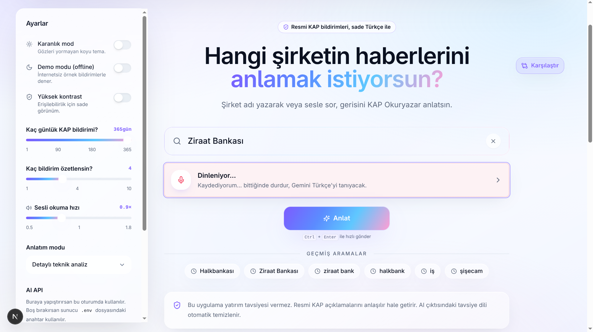
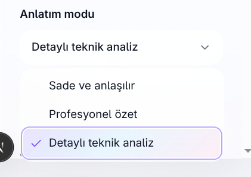
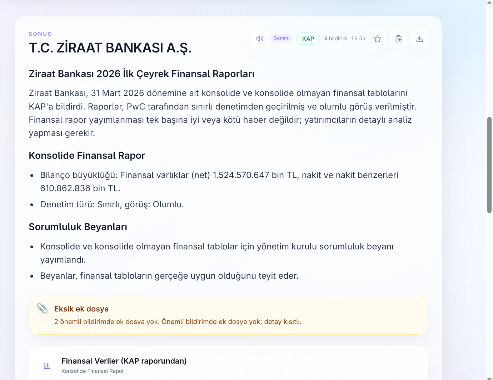
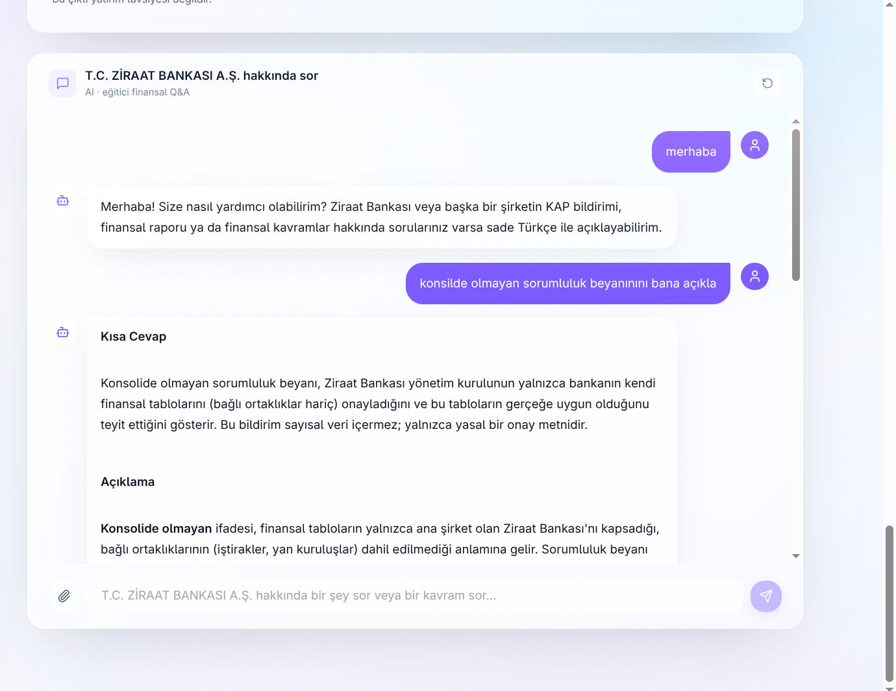
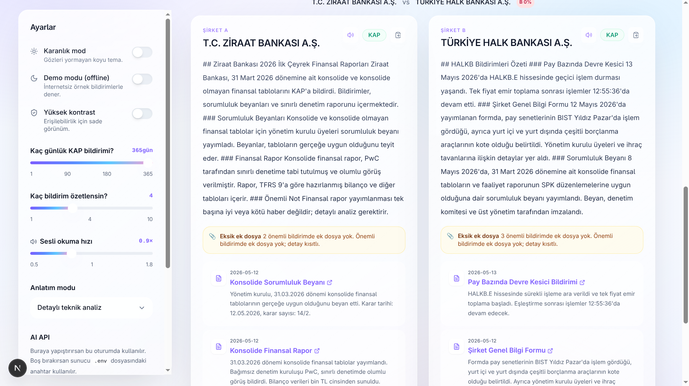

<div align="center">

# 🇹🇷 KAP Okuryazar

### Sesli Finansal Okuryazarlık Asistanı

**KAP bildirimlerini sıradan vatandaşın anlayacağı sade Türkçe'ye çeviren, finansal tabloları yapay zekâya okutturan ve sesle etkileşim kuran bir okuryazarlık asistanı.**

### 🟢 Canlı Demo

[](https://sesli-finansal-okuryazarlik-asistani-ongd5cdrx-technet4311.vercel.app/)
[](https://kap-okuryazar-api.onrender.com)

**Frontend:** https://sesli-finansal-okuryazarlik-asistani-ongd5cdrx-technet4311.vercel.app/
**Backend:** https://kap-okuryazar-api.onrender.com

> İlk açılışta Render'ın free tier'ı backend'i uyandırırken ~30 sn beklemen gerekebilir. Sonrası akıcı.

---

[](https://nextjs.org/)
[](https://react.dev/)
[](https://www.typescriptlang.org/)
[](https://tailwindcss.com/)
[](https://fastapi.tiangolo.com/)
[](https://www.python.org/)
[](https://ai.google.dev/)
[](https://deepseek.com/)

</div>

---

## ⚡ 60 Saniyede Ne Görüyorsunuz?

1. **Vercel linkine tıklayın** → giriş ekranı açılır.
2. **Sidebar'a Gemini API key yapıştırın** (anahtar sunucuya kaydedilmez, tek oturumluk).
3. Arama kutusuna **"Ziraat Bankası"** yazın veya 🎙 **mikrofon** tuşuyla söyleyin.
4. ~10-15 sn içinde:
   - Son KAP bildirimleri **sade Türkçe** ile özetlenir
   - **Finansal Veriler** tablosu KAP HTML'inden yapısal olarak çekilir
   - Anomali kartı (eksik ek, geç bildirim) görünür
   - 🔊 **Sesli okuma** ile dinleyebilirsiniz
5. Aşağıdaki chat kutusuna "**önceki döneme göre nakit nasıl?**" yazın → AI çapraz referanslı cevap verir.

---

## 🎯 Jüri Kriterleri Karşılığı

| Jürinin bakacağı nokta | Bu projede karşılığı |
|---|---|
| **Gerçek problem** | KAP dili yeni yatırımcılar ve finans bilgisi sınırlı kullanıcılar için anlaşılmaz |
| **Gerçek veri** | Canlı KAP API, bildirim HTML sayfaları, PDF/HTML/XML ekleri (mock yok) |
| **AI katkısı** | Gemini 2.5 Flash + DeepSeek V3 ile sadeleştirme, çapraz referanslı chat, Gemini STT/TTS |
| **Özgün teknik taraf** | KAP HTML/XBRL tablolarından **yapısal finansal satır çıkarımı** (aşağıda detay) |
| **Güvenlik & etik** | Yatırım tavsiyesi yasağı, sayı uydurmama kuralı, regex tabanlı safety katmanı |
| **Kullanılabilirlik** | Mikrofon, sesli okuma, 3 anlatım modu, koyu/yüksek kontrast mod, 2 şirket karşılaştırma |
| **Deploy** | Frontend Vercel, backend Render — link tıklanır, çalışır |

---

## 🖼️ Demo Ekranları

| | |
|---|---|
|  |  |
| **Sesli arama + ana ekran** | **3 anlatım modu** (sade / profesyonel / teknik) |
|  |  |
| **KAP özeti, anomali ve finansal tablo** | **Çapraz referanslı soru-cevap** |
|  | |
| **2 şirket yan yana karşılaştırma** | |

---

## 🎯 Problem

KAP (Kamuyu Aydınlatma Platformu) Türkiye'nin tüm halka açık şirketlerinin resmî finansal bildirimlerini yayınladığı zorunlu kaynaktır. Ancak:

- 📚 Bildirimler **finans-hukuk dili** ile yazılır; sıradan vatandaş kavrayamaz.
- 📊 Finansal tablolar **XBRL etiketli HTML tabloları** içinde gömülüdür; standart parser değerleri etiketten koparır.
- ⏱️ Yeni yatırımcı / yaşlı kullanıcı / finans bilgisi sınırlı vatandaşlar **ekonomistten yorum bekler.**
- 🧱 Hâlihazırdaki AI asistanları KAP'ı doğrudan okumaz, **sayı hallüsinasyonu** yapar.

> **Sonuç:** Sermaye piyasalarına erişim bir bilgi asimetrisine takılı kalıyor.

## 💡 Çözüm

1. Kullanıcı şirket adını **yazar veya mikrofona söyler.**
2. Sistem **canlı KAP API'sinden** son bildirimleri çeker.
3. Bildirim HTML'inden **finansal tablo satırları** (Nakit, Varlıklar, Özkaynak, Net Kâr, Faiz...) **yapısal şekilde çıkarılır** — XBRL ve bilingual etiketler temizlenir.
4. Gemini/DeepSeek modeli bu yapısal veriyi **çapraz referanslı, dönem kıyaslamalı, sayısal ve eğitici** bir Türkçe sadeleştirmeye dönüştürür.
5. Kullanıcı sonuca **konuşma diliyle soru sorabilir**; AI birden fazla bildirimi birleştirerek cevaplar.
6. Anlatımı **sade**, **profesyonel** veya **detaylı teknik analiz** modunda alabilir.
7. Tüm metin **Gemini Native TTS** ile sesli okunur.

> 🛡️ **Yatırım tavsiyesi vermez.** Resmî açıklamayı sadeleştirir; sayıyı uydurmaz; "al/sat" dilini regex tabanlı bir safety katmanı temizler.

---

## ✨ Özgün Katkı: KAP HTML Finansal Tablo Çıkarımı

> Bu, projenin **jüri için en önemli teknik farkıdır.** ChatGPT/Claude'a KAP linki verirseniz tablodaki sayıları kaybeder veya yanlış eşler.

KAP'ın finansal disclosure sayfalarındaki tablolar, ilk hücrede XBRL etiketi (`ifrs-full_CashAndCashEquivalents|`), sonraki hücrelerde bilingual Türkçe/İngilizce etiketler, son hücrelerde ise sayısal değerler içerir. Standart `BeautifulSoup.get_text()` bu yapıyı düzleştirip değerleri etiketten koparır.

**Çözüm:**

- 12 öncelikli finansal kalem için **regex + Türkçe normalize** ile satır tespiti
- **Sayısal hücre tanıma** (`_NUMERIC_CELL_RE`): XBRL etiketleri ve bilingual etiketler ayıklanır, sadece gerçek rakamlar kalır
- Çıktı: Cari dönem + önceki dönem + konsolide/bireysel ayrımları korunarak **`{label, values[]}` tablosu**
- AI prompt'una **yapısal veri** olarak gönderilir → **sayı uydurma sıfırlanır**

```python
# Örnek çıktı (T.C. Ziraat Bankası 31.03.2026)
{"label": "Nakit ve Nakit Benzerleri",
 "values": ["610.862.836", "1.159.207.336", "1.770.070.172", "829.612.210"]}
{"label": "Özkaynaklar",
 "values": ["762.192.002", "-12.798.125", "749.393.877", "722.265.964"]}
{"label": "Net Dönem Kârı/Zararı",
 "values": ["50.957.673", "0", "50.957.673", "179.645.756"]}
```

📁 Kod: [`backend/app/services/kap_service.py`](backend/app/services/kap_service.py)

---

## ✨ Diğer Öne Çıkan Özellikler

### 🔀 Çapraz Referanslı AI Chat

Kullanıcı "**sorumluluk beyanındaki değerleri verir misin?**" diye sorduğunda:

- ❌ Yüzeysel cevap: "Bu bildirimde sayısal değer yoktur."
- ✅ KAP Okuryazar: "Sorumluluk beyanı yalnızca yönetim onayını içerir. **Ancak aynı dönem Konsolide Finansal Rapor'da** Nakit ve Nakit Benzerleri **610.862.836 bin TL** (önceki: 1.159.207.336 bin TL, **%47,3 azalış**), Özkaynaklar **762.192.002 bin TL** olarak raporlandı."

### 🗣️ Multimodal Etkileşim

| Mod | Teknoloji | Notlar |
|---|---|---|
| Sesli giriş | Gemini Native Audio (`/api/transcribe/audio`) | Türkçe kelime-kelime transkripsiyon |
| Sesli çıkış | Gemini TTS (`Aoede` ses) | Doğal Türkçe okuma |
| Anlatım seviyesi | `simple` / `professional` / `technical` | Kullanıcı seviyesine göre ton |
| Streaming chat | Server-Sent Events | Token bazlı akış |

### 🛡️ Güvenlik Katmanı

- `safety_service.clean_advice_language` — "al, sat, kesin yükselir" gibi yönlendirici ifadeleri regex ile temizler
- API anahtarı **frontend'e gömülmez**; sidebar'dan tek oturumluk header olarak gönderilir
- Rate limiting (`/api/explain`, chat, TTS, STT, admin endpoint'leri)
- `/api/cache/clear` için `ADMIN_API_TOKEN` zorunlu; varsayılan açık endpoint yok
- KAP'a saygılı: `User-Agent`, 5 MB attachment cap, 15 sn timeout
- Güvenlik header'ları: `X-Frame-Options`, `X-Content-Type-Options`, `Referrer-Policy`, `Permissions-Policy`

### 🎨 Apple-style Liquid Glass UI

Frosted glass paneller, iridescent glow, koyu mod, yüksek kontrast modu (a11y), shadcn/Radix UI tabanlı erişilebilir bileşenler, `localStorage` arama geçmişi, 2 şirket karşılaştırma görünümü.

---

## 🏗️ Mimari

```
┌─────────────────────────────────────────────────────────────────┐
│  Kullanıcı (Web / Mobil)                                        │
└────────────────┬────────────────────────────────────────────────┘
                 │ HTTPS / SSE
                 ▼
┌─────────────────────────────────────────────────────────────────┐
│  Next.js 15 Frontend (Vercel)                                   │
│  React 19 + TS + Tailwind + Radix + react-markdown              │
│  HeroSearch • ResultsPanel • ChatPanel • ComparisonPanel        │
└────────────────┬────────────────────────────────────────────────┘
                 │ REST + SSE  (X-Gemini-Api-Key opsiyonel header)
                 ▼
┌─────────────────────────────────────────────────────────────────┐
│  FastAPI Backend (Render)                                       │
│  Python 3.11 • uvicorn • gzip • CORS                            │
│  ┌─────────────────────┐   ┌────────────────────────┐           │
│  │  KAP Service        │   │  AI Provider Service   │           │
│  │  ─ Fuzzy match      │   │  ─ Gemini 2.5 Flash    │           │
│  │  ─ HTML table       │   │  ─ DeepSeek V3         │           │
│  │    extraction (★)   │   │  ─ Streaming bridge    │           │
│  │  ─ PDF/XBRL parse   │   │  ─ JSON-mode parsing   │           │
│  └──────────┬──────────┘   └──────────┬─────────────┘           │
│             │                          │                         │
│  ┌──────────▼──────────────────────────▼──────────────┐         │
│  │  Summarizer + Safety + Anomaly Detection           │         │
│  │  ─ compact_disclosures (prompt budget)             │         │
│  │  ─ clean_advice_language (regex hard-stop)         │         │
│  │  ─ detect_anomalies (late, missing attach)         │         │
│  └────────────────────────────────────────────────────┘         │
└────────────────┬────────────────────────────────────────────────┘
                 │ HTTPS
                 ▼
┌─────────────────────────────────────────────────────────────────┐
│  KAP API (kap.org.tr)         Gemini / DeepSeek API             │
│  - Disclosure search          - Sadeleştirme + chat             │
│  - HTML (XBRL tables)         - TTS (Aoede)                     │
│  - PDF attachments            - STT (Native Audio)              │
└─────────────────────────────────────────────────────────────────┘
```

---

## 🧰 Teknoloji Yığını

**Backend:** Python 3.11 · FastAPI 0.115 · uvicorn · Pydantic v2 · google-genai · BeautifulSoup4 · pypdf · rapidfuzz
**Frontend:** Next.js 15 · React 19 · TypeScript 5.7 · Tailwind 3.4 · Radix UI · lucide-react · react-markdown · rehype-katex
**AI:** Gemini 2.5 Flash (sadeleştirme, chat, JSON) · Gemini Native Audio (STT) · Gemini TTS (Aoede) · DeepSeek V3 (drop-in fallback)
**Veri:** KAP API (`kap.org.tr`) — HTML disclosure, XBRL tablolar, PDF/HTML/XML attachment

---

## 🚀 Deploy

Bu proje **production'da çalışıyor** — yukarıdaki linklere tıklayın. Aşağıdaki bölüm kendi ortamına nasıl deploy ederiz onu anlatır.

### Frontend — Vercel

```bash
cd frontend
vercel --prod
```

Vercel environment variable:

```
NEXT_PUBLIC_API_BASE_URL=https://kap-okuryazar-api.onrender.com
```

### Backend — Render

Repo kökünde [`render.yaml`](render.yaml) hazır. Render dashboard → New → Blueprint → bu repo seçilir.

Render environment variable:

```bash
AI_PROVIDER=gemini
ALLOWED_ORIGINS=https://<frontend>.vercel.app
TRUST_PROXY_HEADERS=true
```

Gemini API anahtarı **sunucuya değil**, kullanıcı sidebar'ından header olarak gönderilir.

📁 Detaylı deploy notları: [`DEPLOYMENT.md`](DEPLOYMENT.md)

---

## 💻 Local Geliştirme

### Tek Tık (Windows)

```powershell
git clone https://github.com/Technet43/sesli-finansal-okuryazarlik-asistani.git
cd sesli-finansal-okuryazarlik-asistani
```

`start.bat`'a çift tıkla — Python/Node eksikse `winget` ile kurar, `.env` dosyalarını oluşturur, backend (`:8000`) ve frontend (`:3000`) açar.

### Linux / macOS

```bash
# Backend
python -m venv .venv && source .venv/bin/activate
pip install -r backend/requirements.txt
cp backend/.env.example backend/.env
cd backend && PYTHONPATH=.. uvicorn app.main:app --reload  # :8000

# Frontend (ayrı terminal)
cd frontend
npm install
cp .env.example .env.local
npm run dev  # :3000
```

API anahtarı sidebar'dan tek oturumluk olarak yapıştırılır (`X-Gemini-Api-Key` header'ı).

---

## 🎬 Demo Senaryoları

**1. Sıradan vatandaş:** "İş Bankası" yazılır / söylenir → 13 saniyede sadeleştirilmiş özet + finansal tablo + sesli okuma.

**2. Finansal veri sorgusu:** "TCZB sorumluluk beyanındaki değerleri verir misin" → AI çapraz referansla aynı dönemin Konsolide Finansal Rapor'undaki gerçek sayıları getirir.

**3. Anomali tespiti:** Bildirimde ek dosya eksikse sarı amber kartla otomatik flag'lenir.

**4. Sesli + kişiselleştirilmiş:** Mikrofonla şirket adı söylenir → "Sade", "Profesyonel" veya "Teknik" mod seçilir → aynı veri farklı seviyede anlatılır.

**5. Karşılaştırma:** Ziraat Bankası vs Halkbank yan yana özetlenir.

---

## 🔬 Önemli Mimari Kararlar

| Karar | Gerekçe |
|---|---|
| **HTML önceliği (PDF değil)** | KAP'ın PDF API'si kapak sayfası döndürür; finansal tablolar HTML body'de XBRL etiketli yaşar. Yapısal extraction sadece HTML'den mümkün. |
| **`{label, values}` tablosu** | AI bilingual-label tuzağına düşmesin diye sayısal hücreler ayrı alanda taşınır; UI doğrudan render eder. |
| **AI sağlayıcı soyutlaması** | Gemini kotası bittiğinde DeepSeek (OpenAI uyumlu) drop-in. Streaming her ikisinde aynı API. |
| **Sayı uydurma yasağı (çift katman)** | Prompt kuralı + post-processing regex; sayılar **yalnızca bağlamdan** gelir. |

---

## 📁 Proje Yapısı

```
sesli-finansal-okuryazarlik-asistani/
├── kap_okuryazar/                   # Ortak Python çekirdeği (config, demo_data, safety)
├── backend/
│   └── app/
│       ├── main.py                  # FastAPI app, endpoint'ler, rate limit
│       ├── core/                    # config, bootstrap
│       ├── models/schemas.py        # Pydantic şemaları
│       └── services/
│           ├── kap_service.py       # KAP scraping + HTML table extraction (★)
│           ├── gemini_service.py    # Gemini client
│           ├── ai_provider_service.py  # Gemini/DeepSeek soyutlama
│           ├── summarizer_service.py
│           ├── safety_service.py    # clean_advice_language
│           └── tts_service.py
├── frontend/
│   └── src/
│       ├── app/                     # Next.js App Router
│       ├── components/
│       │   ├── HeroSearch.tsx       # Arama + mikrofon
│       │   ├── ResultsPanel.tsx     # Özet + Finansal Veriler + bildirimler (★)
│       │   ├── ChatPanel.tsx        # Çapraz referanslı sohbet (★)
│       │   ├── ComparisonPanel.tsx
│       │   └── ui/                  # shadcn-style Radix bileşenleri
│       └── lib/                     # api, types, useTextToSpeech, useSpeechRecognition
├── render.yaml                      # Render Blueprint
├── DEPLOYMENT.md                    # Deploy rehberi
├── start.bat / start.ps1            # Windows tek-tık başlatıcı
└── HACKATHON_NOTLARI.md             # Jüri için kısa pitch
```

★ = projenin özgün katkı noktaları.

---

## 🛡️ Güvenlik ve Etik

- **Yatırım tavsiyesi vermez.** "Al / sat / kesin yükselir" ifadeleri hem AI prompt'unda yasak hem de `clean_advice_language` regex'i ile post-processing'de temizlenir.
- **Sayı uydurmaz.** Finansal değerler **yalnızca KAP HTML tablosundan veya attachment'tan** gelir.
- **API anahtarları repoya commitlenmez.** `.gitignore` + `.env.example` mevcuttur.
- **Rate limiting.** Per-IP in-memory bucket, KAP'a aşırı yük bindirmez.
- **CORS sıkı.** `ALLOWED_ORIGINS` env'i kontrol eder.
- **Disclaimer her yerde.** API yanıtında + UI alt bilgisinde sabit.

---

## ⚠️ Bilinen Sınırlılıklar

- **Render free tier soğuk başlangıcı:** Backend ~30 sn uyanma süresi gerektirir.
- Karşılaştırma ekranında chat paneli şu an gizlenir (sonraki sürümde dock olarak görünür kalacak).
- Mikrofon transkripsiyonu Gemini API anahtarına bağlıdır; anahtar hatalıysa yazılı arama çalışmaya devam eder.

---

## 🔮 Yol Haritası

- [ ] PWA / mobil uygulama (offline demo + push)
- [ ] Tarihsel kıyas grafikleri (recharts)
- [ ] PDF OCR fallback (Tesseract)
- [ ] Sektör benchmark karşılaştırması
- [ ] Webhook + favori şirket bildirimi
- [ ] EN UI (i18n)

---

## 📜 Lisans

MIT — eğitim ve sosyal etki amaçlı.

## 👥 Ekip

**Technet43** — Hackathon'26 katılımcısı

---

<div align="center">

### 🇹🇷 Türkiye'de finansal okuryazarlığı artırmak için yapıldı.

**Yatırım tavsiyesi vermez — resmî açıklamayı sade Türkçe'ye çevirir.**

[🟢 Canlı Demo'yu Aç](https://sesli-finansal-okuryazarlik-asistani-ongd5cdrx-technet4311.vercel.app/)

</div>
